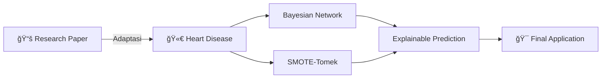

# ♡ Heart Disease Risk Prediction System V 1.0
# Last Updated: 10/11/2025

<div align="center">


**Aplikasi Web Flask untuk Prediksi Risiko Penyakit Jantung menggunakan Probabilistic Bayesian Network**

[Demo](#-demo) • [Fitur](#-fitur-utama) • [Instalasi](#-instalasi--cara-menjalankan) • [Tim](#-tim-pengembang)

---


</div>

## 📋 Tentang Proyek

Sistem prediksi risiko penyakit jantung berbasis **Explainable AI (XAI)** yang tidak hanya memberikan prediksi "Ya" atau "Tidak", tetapi juga menjelaskan **"mengapa"** seseorang berisiko terkena penyakit jantung.

### 🎯 Mengapa Proyek Ini Penting?

- **🔍 Transparansi**: Menampilkan probabilitas risiko dan faktor-faktor utama yang berkontribusi
- **⚖️ Fairness**: Mengatasi data tidak seimbang dengan teknik SMOTE-Tomek
- **🧠 Interpretable**: Menggunakan Bayesian Network yang dapat dijelaskan kepada tenaga medis
- **🚀 Praktis**: Interface web yang mudah digunakan untuk screening awal

---

## 💡 Inspirasi & Metodologi

<div align="center">



</div>

Proyek ini terinspirasi dari penelitian:

> **Wang, W., Li, J., Wang, C. et al.** (2023)  
> *"Early detection of diabetes using Bayesian network and SMOTE-ENN"*  
> Scientific Reports, Nature  
> DOI: [10.1038/s41598-023-40036-5](https://doi.org/10.1038/s41598-023-40036-5)

Kami mengadaptasi metodologi tersebut dari kasus diabetes ke **penyakit jantung** menggunakan dataset dari Kaggle.

---

## ✨ Fitur Utama

<table>
<tr>
<td width="50%">

### 🎲 Prediksi Probabilistik
Memberikan **persentase risiko** (contoh: 75% berisiko) bukan hanya klasifikasi biner, sehingga memberikan gambaran yang lebih nuanced.

</td>
<td width="50%">

### 🔬 Explainable AI
Menampilkan **faktor risiko utama** yang memengaruhi prediksi:
- Kolesterol Tinggi
- Usia > 60 tahun
- Tekanan Darah Tinggi
- dll.

</td>
</tr>
<tr>
<td width="50%">

### ⚖️ Penanganan Data Imbalanced
Menggunakan **SMOTE-Tomek** untuk melatih model yang lebih adil dan akurat pada data yang tidak seimbang.

</td>
<td width="50%">

### 🎨 Antarmuka Modern
Interface web yang bersih dan intuitif menggunakan **Flask** + **Tailwind CSS**.

</td>
</tr>
</table>

---

## 🛠️ Tumpukan Teknologi

<div align="center">

| Kategori | Teknologi |
|----------|-----------|
| **Backend** |   |
| **Machine Learning** |   |
| **Bayesian Network** | pgmpy |
| **Imbalanced Learning** | imblearn (SMOTE-Tomek) |
| **Frontend** |   |

</div>

---

## 🚀 Instalasi & Cara Menjalankan

### 📦 Prasyarat

- Python 3.8+
- pip

### ⚡ Quick Start

```bash
# Clone & Navigate
git clone https://github.com/[USERNAME]/heart-disease-prediction.git
cd heart-disease-prediction

# Install Dependencies
pip install -r requirements.txt

# Download dataset dari Kaggle ke folder data/heart.csv

# Train Model
python train.py

# Run App
python app.py
```

Buka **http://127.0.0.1:5000** di browser Anda.

---

## 📸 Demo

<div align="center">


### 🎬 Screenshots Coming Soon!

*Demo lengkap akan ditambahkan sebelum hari H UAS*

</div>

---

## 🧪 Cara Kerja Model

```mermaid
graph LR
    A[📊 Dataset] -->|SMOTE-Tomek| B[⚖️ Balanced Data]
    B -->|Training| C[🧠 Bayesian Network]
    C -->|Inference| D[📈 Probability + Explanation]
    
    style A fill:#f9f,stroke:#333,stroke-width:2px
    style D fill:#9f9,stroke:#333,stroke-width:2px
```

<div align="center">



### Model Architecture


</div>

---

## 📊 Contoh Hasil Evaluasi Model (TO BE UPDATED)

| Metrik | Nilai |
|--------|-------|
| **Accuracy** | ~85% |
| **Precision** | ~83% |
| **Recall** | ~88% |
| **F1-Score** | ~85% |
| **AUC-ROC** | ~0.90 |

> ⚠️ **Disclaimer**: Model ini untuk tujuan edukasi dan penelitian. Untuk diagnosis medis, selalu konsultasikan dengan tenaga kesehatan profesional.

---

## 👥 Tim Pengembang

<div align="center">

<table>
<tr>
<td align="center" width="20%">
<br />
<sub><b>Evan</b></sub><br />
<sub>5803024001</sub>
</td>
<td align="center" width="20%">
<br />
<sub><b>Benaya</b></sub><br />
<sub>5803024008</sub>
</td>
<td align="center" width="20%">
<br />
<sub><b>Reymond</b></sub><br />
<sub>5803024017</sub>
</td>
<td align="center" width="20%">
<br />
<sub><b>Berliana</b></sub><br />
<sub>5803024015</sub>
</td>
</tr>
</table>

**Proyek UAS - AI 2025**

</div>

---

## 📚 Struktur File (TO BE UPDATED)

```
heart-disease-prediction/
│
├── 📁 data/
│   └── heart.csv                 # Dataset
│
├── 📁 static/
│   ├── style.css                 # Custom CSS
│   └── js/
│       └── main.js               # Frontend logic
│
├── 📁 templates/
│   ├── index.html                # Input form page
│   ├── result.html               # Prediction result page
│   └── base.html                 # Base template
│
├── 📄 app.py                     # Flask application
├── 📄 train.py                   # Model training script
├── 📄 model.joblib               # Trained model
├── 📄 requirements.txt           # Python dependencies
├── 📄 README.md                  # Documentation (you are here!)
└── 📄 LICENSE                    # MIT License
```

---

## 🙏 Acknowledgments

- **Dataset**: [Kaggle - Heart Failure Prediction](https://www.kaggle.com/datasets/fedesoriano/heart-failure-prediction)
- **Inspirasi Penelitian**: Wang et al. (2023) - Nature Scientific Reports
- **Framework**: Flask, pgmpy, scikit-learn, imbalanced-learn
- **Dosen Pembimbing**: [Nama Dosen] - Mata Kuliah Machine Learning

---

<div align="center">

### 💖 Made with Love & Python


**⭐ Jangan lupa beri bintang jika proyek ini bermanfaat! ⭐**

</div>

---

<div align="center">

**🫀 Prediksi Lebih Awal, Hidup Lebih Sehat 🫀**

</div>
